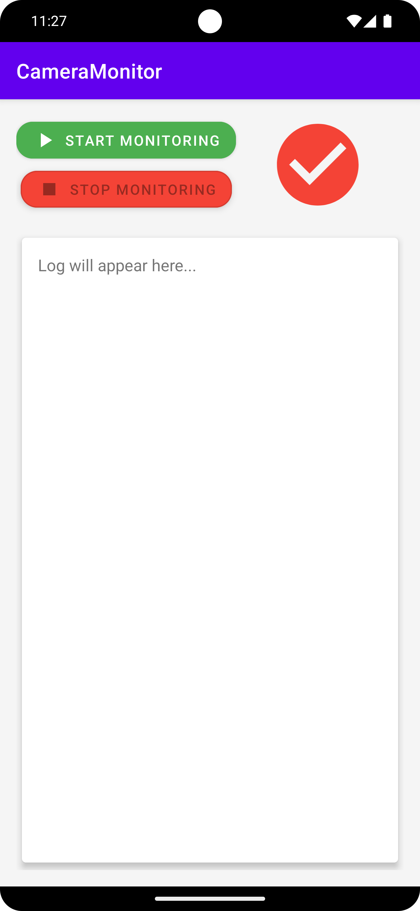

# CameraMonitor

Приложение для мониторинга использования камеры на устройстве Android. Показывает, какое приложение в данный момент использует камеру, и ведёт лог событий.

## Основные возможности
- Отслеживание событий открытия/закрытия камеры (Camera2 API)
- Определение приложения, использующего камеру (через AppOpsManager и UsageStatsManager)
- Вывод расширенной информации: имя приложения, package name, путь к APK
- Ведение лога событий с автоскроллом
- Уведомления о событиях использования камеры
- Сохранение лога при перевороте экрана (устойчивость к rotation)

## Как работает
- Сервис `CameraMonitorService` отслеживает состояние камеры через `CameraManager.AvailabilityCallback` и операции с камерой через `AppOpsManager.OnOpChangedListener`.
- Если AppOpsManager не сообщает пакет, используется резервный способ — определение foreground-приложения через UsageStatsManager.
- Все события отправляются в MainActivity через BroadcastReceiver, где формируется лог и отправляются уведомления.

## Требуемые разрешения
- **Usage Access** (Доступ к статистике использования) — необходим для определения foreground-приложения.
- **POST_NOTIFICATIONS** (Android 13+) — для отображения уведомлений.

## Особенности
- Если невозможно определить приложение, использующее камеру, в логе и уведомлении будет указано "Неизвестное приложение".
- Для корректной работы UsageStatsManager пользователь должен вручную выдать разрешение через настройки (приложение подскажет при запуске).
- Лог событий не сбрасывается при перевороте экрана.

## Структура проекта
- `MainActivity.kt` — UI, лог событий, запуск/остановка сервиса, обработка разрешений.
- `CameraMonitorService.kt` — foreground-сервис, отслеживание состояния камеры и приложений.
- `CameraBroadcastReceiver.kt` — приём событий от сервиса.
- `NotificationHelper.kt` — создание и отображение уведомлений.

## Сборка и запуск
1. Откройте проект в Android Studio.
2. Соберите и установите приложение на устройство (API 21+).
3. При первом запуске предоставьте доступ к Usage Access и (на Android 13+) к уведомлениям.

## Скриншоты

Скриншоты интерфейса и уведомлений размещайте в папке `screenshots/`.

---

**Вопросы и предложения:**
Пишите в issues или на почту разработчика.
