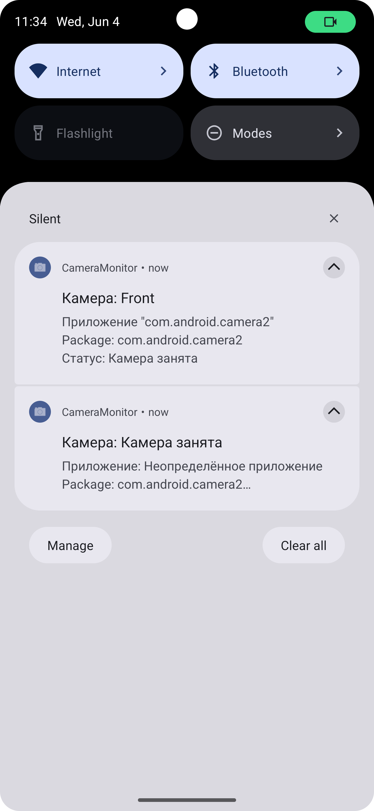

# CameraMonitor

Приложение для мониторинга использования камеры на устройстве Android. Показывает, какое приложение в данный момент использует камеру, и ведёт подробный лог событий с расширенным форматированием.

## Основные возможности
- Отслеживание событий открытия/закрытия камеры (Camera2 API)
- Корректное логирование при переключении между камерами (фиксируется освобождение одной и захват другой)
- Независимое логирование для каждой камеры
- Определение приложения, использующего камеру (приоритет lastOpPackage, затем foreground app, затем "Неизвестно")
- Вывод расширенной информации: имя приложения (жирным, синим цветом, увеличено), package name, путь к APK
- Ведение лога событий с автоскроллом к последнему событию
- Хранение лога как списка событий (JSON) с восстановлением форматирования при запуске
- Уведомления о событиях использования камеры
- Меню с пунктами: Главная, Статистика по дням, Настройка, О приложении
- Устойчивость к перевороту экрана и крашам (лог сохраняется и восстанавливается)

## Как работает
- Сервис `CameraMonitorService` отслеживает состояние каждой камеры через `CameraManager.AvailabilityCallback` и операции с камерой через `AppOpsManager.OnOpChangedListener`.
- Все события отправляются в MainActivity через BroadcastReceiver, где формируется лог с форматированием и отправляются уведомления.
- Лог хранится в SharedPreferences в формате JSON, при запуске форматирование восстанавливается.
- При добавлении события лог автоматически прокручивается к последнему.

## Требуемые разрешения
- **Usage Access** (Доступ к статистике использования) — необходим для определения foreground-приложения.
- **POST_NOTIFICATIONS** (Android 13+) — для отображения уведомлений.

## Особенности
- Если невозможно определить приложение, использующее камеру, в логе и уведомлении будет указано "Неизвестное приложение".
- Для корректной работы UsageStatsManager пользователь должен вручную выдать разрешение через настройки (приложение подскажет при запуске).
- Лог событий не сбрасывается при перевороте экрана или крашах приложения.
- Форматирование лога (цвет, жирность, размер имени приложения) сохраняется при перезапуске.
- При переключении между камерами всегда фиксируется освобождение одной и захват другой.
- В меню доступны дополнительные разделы (заглушки).

## Структура проекта
- `MainActivity.kt` — UI, лог событий, запуск/остановка сервиса, обработка разрешений, автоскролл, меню.
- `CameraMonitorService.kt` — foreground-сервис, отслеживание состояния камеры и приложений.
- `CameraBroadcastReceiver.kt` — приём событий от сервиса.
- `NotificationHelper.kt` — создание и отображение уведомлений.
- `main_menu.xml` — меню приложения.

## Сборка и запуск
1. Откройте проект в Android Studio.
2. Соберите и установите приложение на устройство (API 21+).
3. При первом запуске предоставьте доступ к Usage Access и (на Android 13+) к уведомлениям.

## Скриншоты

Скриншоты интерфейса и уведомлений размещайте в папке `screenshots/`.

  
  

---

**Вопросы и предложения:**
Пишите в issues или на почту разработчика.
